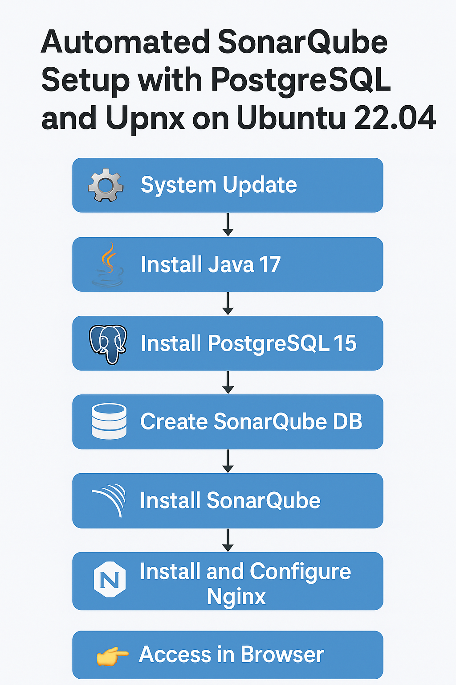
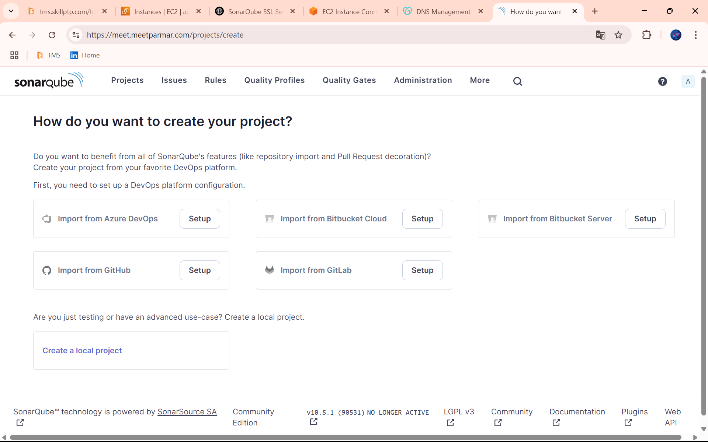

# Automated-SonarQube-Setup-with-PostgreSQL-and-Nginx-on-Ubuntu-22.04



# 🚀 Full Step-by-Step SonarQube Installation on Ubuntu 22.04

A complete guide to installing and configuring SonarQube on Ubuntu 22.04 with PostgreSQL, systemd service, and Nginx reverse proxy.

---

## ✅ Step 1: System Update
```bash
sudo apt update
sudo apt upgrade -y
```

## ✅ Step 2: Install Java 17 (Required by SonarQube)
```bash
sudo apt install openjdk-17-jdk -y
java -version
```

## ✅ Step 3: Install PostgreSQL 15

### 3.1 Install Dependencies & Repo Key
```bash
sudo apt install curl ca-certificates gnupg -y
sudo install -d /usr/share/postgresql-common/pgdg
sudo curl -o /usr/share/postgresql-common/pgdg/apt.postgresql.org.asc https://www.postgresql.org/media/keys/ACCC4CF8.asc
```

### 3.2 Add PostgreSQL Repo
```bash
echo "deb [signed-by=/usr/share/postgresql-common/pgdg/apt.postgresql.org.asc] https://apt.postgresql.org/pub/repos/apt $(lsb_release -cs)-pgdg main" | sudo tee /etc/apt/sources.list.d/pgdg.list
sudo apt update
```

### 3.3 Install PostgreSQL 15
```bash
sudo apt install postgresql-15 -y
```

## ✅ Step 4: Create SonarQube DB and User

### 4.1 Switch to PostgreSQL User
```bash
sudo -i -u postgres
```

### 4.2 Create User and DB
```bash
createuser sonar
createdb sonar -O sonar
```

### 4.3 Set Password
```bash
psql
ALTER USER sonar WITH ENCRYPTED PASSWORD '123';
\q
exit
```

## ✅ Step 5: Install SonarQube

### 5.1 Download & Extract
```bash
wget https://binaries.sonarsource.com/Distribution/sonarqube/sonarqube-10.5.1.90531.zip
sudo apt install unzip -y
unzip sonarqube-10.5.1.90531.zip
sudo mv sonarqube-10.5.1.90531 /opt/sonarqube
```

### 5.2 Create a System User
```bash
sudo adduser --system --no-create-home --group --disabled-login sonarqube
sudo chown -R sonarqube:sonarqube /opt/sonarqube
```

### 5.3 Configure Database Connection
```bash
sudo nano /opt/sonarqube/conf/sonar.properties
```

Uncomment/add:
```ini
sonar.jdbc.username=sonar
sonar.jdbc.password=123
sonar.jdbc.url=jdbc:postgresql://localhost/sonar
```

## ✅ Step 6: Configure System Limits
```bash
echo "sonarqube - nofile 65536" | sudo tee -a /etc/security/limits.conf
echo "sonarqube - nproc 4096" | sudo tee -a /etc/security/limits.conf
echo "vm.max_map_count=262144" | sudo tee -a /etc/sysctl.conf
sudo sysctl -p
```

## ✅ Step 7: Create Systemd Service for SonarQube
```bash
sudo nano /etc/systemd/system/sonarqube.service
```

Paste:
```ini
[Unit]
Description=SonarQube service
After=syslog.target network.target

[Service]
Type=forking
ExecStart=/opt/sonarqube/bin/linux-x86-64/sonar.sh start
ExecStop=/opt/sonarqube/bin/linux-x86-64/sonar.sh stop
User=sonarqube
Group=sonarqube
Restart=always
LimitNOFILE=65536
LimitNPROC=4096

[Install]
WantedBy=multi-user.target
```

### Reload and Start Service
```bash
sudo systemctl daemon-reexec
sudo systemctl daemon-reload
sudo systemctl start sonarqube
sudo systemctl enable sonarqube
sudo systemctl status sonarqube
```

## ✅ Step 8: Install and Configure Nginx Reverse Proxy
```bash
sudo apt install nginx -y
sudo nano /etc/nginx/sites-available/sonarqube
```

Paste config:
```nginx
server {
    listen 80;
    server_name dhruv.meetparmar.com;

    location / {
        proxy_pass http://127.0.0.1:9000;
        proxy_set_header Host $host;
        proxy_set_header X-Real-IP $remote_addr;
        proxy_set_header X-Forwarded-For $proxy_add_x_forwarded_for;
        proxy_set_header X-Forwarded-Proto $scheme;
        proxy_redirect off;
    }
}
```

Enable and test:
```bash
sudo ln -s /etc/nginx/sites-available/sonarqube /etc/nginx/sites-enabled/
sudo nginx -t
sudo systemctl restart nginx
```

## ✅ Step 9: (Optional) Enable SSL with Certbot
```bash
sudo apt install certbot python3-certbot-nginx -y
sudo certbot --nginx -d dhruv.meetparmar.com
```

---

## ✅ Final Step: Access in Browser

- **HTTP:** http://meet.meetparmar.com
- **HTTPS (if enabled):** https://meet.meetparmar.com  

**Login:**  
- Username: `admin`  
- Password: `admin`

---

📌 Make sure to change your admin password after login.

---
### ✅ Final Output


---
